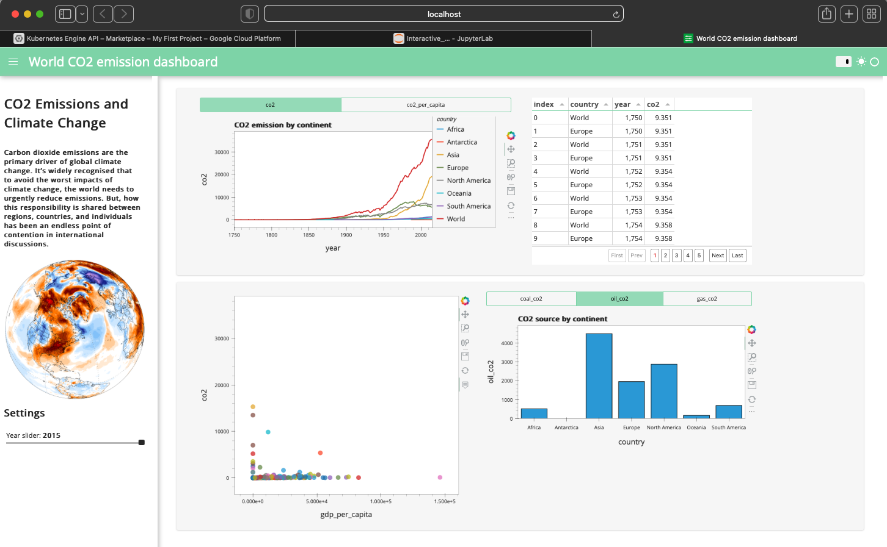

# Resume Graphs

### Jupyter notebooks explaining my current studies and projects.

### Please review [ResumeGraphs](https://github.com/Greg-Kojadinovich/resumegraphs/blob/main/ResumeGraphs.ipynb) and [DuolingoPerformance](https://github.com/Greg-Kojadinovich/resumegraphs/blob/main/DuolingoPerformance.ipynb). 

## Projects

| Project  	| Thumbnail  	| Description  	| Link  	|
|:-:	|:-:	|:-:	|:-:	|
| space-dash-app  	|   	| This app is an interactive dashboard displaying the success rate of Falcon 9 landings. Built with Dash and Plotly Express, deployed on Heroku.  	| [App Link](https://space-dash-app.herokuapp.com)  	|
| philip  	|   	| philip, my algorithmic trading bot, will be my way of "making money as I sleep"   philip will use a chandelier exit & two RSI indicators for a trading strategy,  twitter/news NLP sentiment from orange,   and websockets and price data from Binance API.  Backtesting will be done in [Backtrader](https://github.com/mementum/backtrader) and [Clear - QuantConnect](https://github.com/QuantConnect/Lean)   	| TBD  	|
| co2-panel-app  	|   	| Created an interactive python dashboard with Hvplots and Panel. Followed this [tutorial](https://www.youtube.com/watch?v=uhxiXOTKzfs&t=26s) 	| [Github Link](https://github.com/Greg-Kojadinovich/python-dashboard-panel)  	|
| solar-system  	|   	| Learning some astrophysics and interacting with JPL API via Astroquery Horizons.   I am trying to expand this model to include all the planets and still look nice.   Below is my work reviewing the equations.      I followed this [medium article](https://medium.com/analytics-vidhya/simulating-the-solar-system-with-under-100-lines-of-python-code-5c53b3039fc6) 	| [Github Link](https://github.com/Greg-Kojadinovich/python-solar-system)  	|
| wildfire-tracker  	|   	| Built a React app to track wildfires using NASA's EONET API & Google Maps API. Followed this [tutorial](https://www.youtube.com/watch?v=ontX4zfVqK8&t=136s)  	| [Github Link](https://github.com/Greg-Kojadinovich/wildfire-tracker)  	|
| orange-twitter-NLP  	|   	| Using Orange to pull 1000+ tweets related to stocks & crypto for Vadar sentiment analysis for philip.     	| TBD  	|
| tinyYOLO  	|   	| Deployed deep learning Object Detection model [YOLOV3](https://pjreddie.com/darknet/yolo/) using python-conda virtual enviromental and Docker. Sent HTTP Post Requests of ML model to FastAPI framework.   	| [Github Link](https://github.com/Greg-Kojadinovich/machine-learning-engineering-for-production-public/tree/main/course1/week1-ungraded-lab)  	|

---
